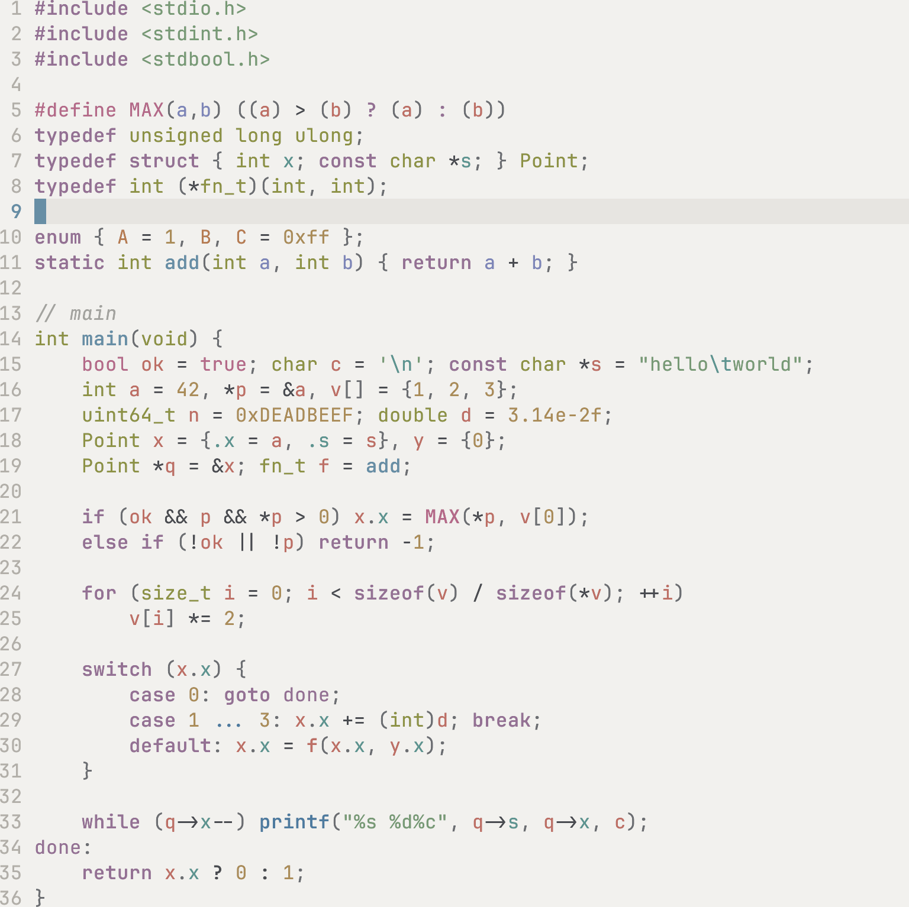
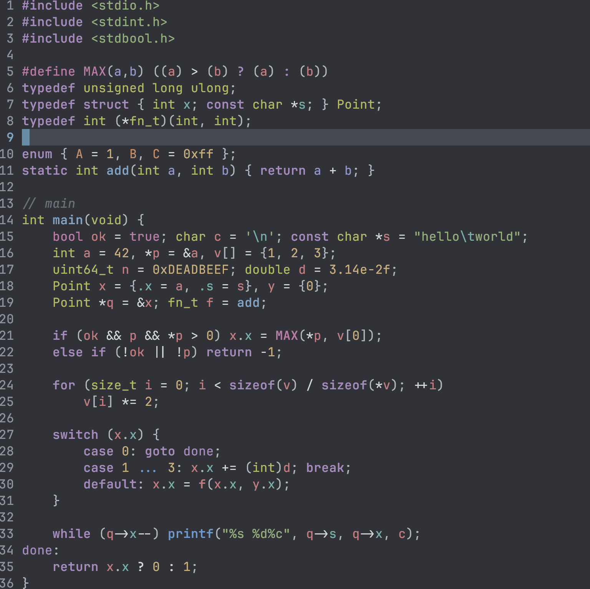

# terrazzo

A muted, matte colorscheme for Neovim, in light and dark variants.

Terrazzo is a floor made of stone chips (terracotta, ochre, sage, slate blue, mauve) set in a neutral cement base. That is also how this theme is built: a quiet background, and syntax colors that are distinct from one another but never loud.

<!-- Add screenshots here, e.g. assets/light.png and assets/dark.png -->
<p>
  
  
</p>


## Features

- Light and dark variants sharing one highlight definition
- Twelve syntax roles, each with its own hue: keyword, string, function, variable, number, type, property, parameter, constant, builtin, macro and comment
- Tree-sitter captures and LSP semantic tokens mapped explicitly, so nothing falls back to Neovim's defaults by accident
- Diagnostics, diffs, spell checking and the terminal palette
- Extra groups for Telescope, NERDTree, GitGutter, ALE, Coc and mini.indentscope
- One small palette file, easy to override

## Requirements

- Neovim 0.10 or newer (the theme uses capture names such as `@variable.parameter` and `@keyword.import`)
- A terminal with true color support

## Installation

With [lazy.nvim](https://github.com/folke/lazy.nvim):

```lua
{
  "fibonatto/terrazzo",
  lazy = false,
  priority = 1000,
  config = function()
    vim.cmd.colorscheme("terrazzo")
  end,
}
```

## Usage

```lua
vim.cmd.colorscheme("terrazzo")        -- dark
vim.cmd.colorscheme("terrazzo-light")  -- light
```

Or from the command line: `:colorscheme terrazzo` and `:colorscheme terrazzo-light`.

## Palette

### Syntax colors

| Role      | Light     | Dark      | Used for                                                     |
| --------- | --------- | --------- | ------------------------------------------------------------ |
| keyword   | `#9A6F96` | `#a98abf` | Keywords, conditionals, loops, imports (bold)                |
| string    | `#6E9B73` | `#8eae7a` | Strings, characters                                          |
| func      | `#5B8FA8` | `#78a4c4` | Function and method definitions and calls (bold)             |
| variable  | `#C96A61` | `#c97a80` | Variables, HTML tags                                         |
| number    | `#B08B4F` | `#c9ad79` | Numbers                                                      |
| type      | `#8C9236` | `#b0b65c` | Types, primitive types, modules, constructors                |
| property  | `#4A9690` | `#68b0a6` | Fields, members, tag attributes, escape sequences            |
| parameter | `#7C86BC` | `#8f97c8` | Function parameters                                          |
| constant  | `#C0794A` | `#c98a62` | Constants, booleans, `NULL` and `nil`                        |
| builtin   | `#3F7CA3` | `#6499cc` | `self` and `this`, standard library functions, builtin modules |
| macro     | `#C0658A` | `#c27aa8` | Preprocessor directives, macros, attributes and decorators   |
| comment   | `#A3A39E` | `#6b7179` | Comments (italic)                                            |

### Base colors

| Role     | Light     | Dark      |
| -------- | --------- | --------- |
| fg       | `#4A4C52` | `#cfd3d8` |
| fg_soft  | `#6B6E73` | `#aeb5bd` |
| bg       | `#F2F1EE` | `#2f3238` |
| bg_alt   | `#EAE8E4` | `#383B42` |
| bg_soft  | `#E5E3DF` | `#41454D` |
| border   | `#D3D0CA` | `#535861` |

The full palette, including selection, search, cursorline and diff colors, lives in [`lua/terrazzo/palette.lua`](lua/terrazzo/palette.lua).

## Customization

Colors are plain Lua tables. Change them before loading the colorscheme:

```lua
local palette = require("terrazzo.palette")

palette.dark.bg = "#262a30"
palette.light.keyword = "#8a5f86"

vim.cmd.colorscheme("terrazzo")
```

## Project structure

```
colors/
  terrazzo.lua         dark variant
  terrazzo-light.lua   light variant
lua/terrazzo/
  palette.lua          light and dark palettes
  highlights.lua       maps palette colors to highlight groups
  util.lua             highlight helper
```

## Acknowledgements

Terrazzo started as a fork of [One Half](https://github.com/sonph/onehalf) by sonph, and still borrows its overall idea of how colors map to syntax roles. The palette has since been redesigned, so it no longer looks like the original.

## License

MIT
